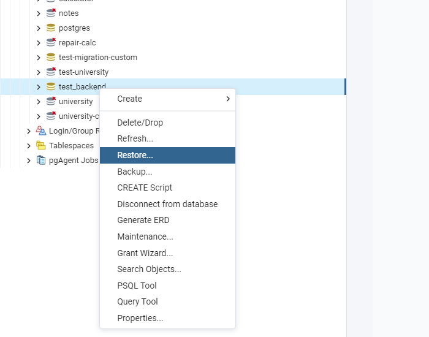
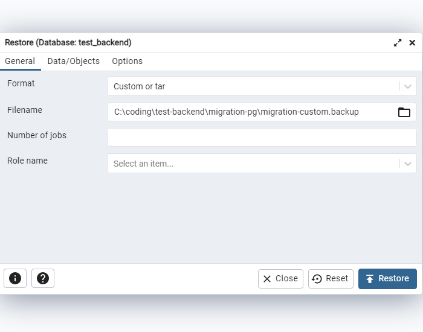

# Тестовое задание Backend Node

## Установка

### Миграция базы данных

Откройте pgAdmin

Создайте базу данных c именем `test_backend`

    

Затем нажмите restore/восстановить на вкладке созданной базы данных

    

Выберите файл `migration-custom.backup` в папке `migration-custom` данного проекта и нажмите restore/восстановить

    

### Установка и запуск сервера

* Скачайте репозиторий
* В папке репозитория выполните команду в терминале `npm install`
* Затем выполните команду `npm run server`

